### Criando o IAM Role para as instâncias EC2 para Deploy

- Acessar IAM, Roles, clicar em `CreateRole`
- `Trusted entity type`: `AWS service`
- Selecionar `Service or use case`: `EC2`, case `EC2`, clica em Next

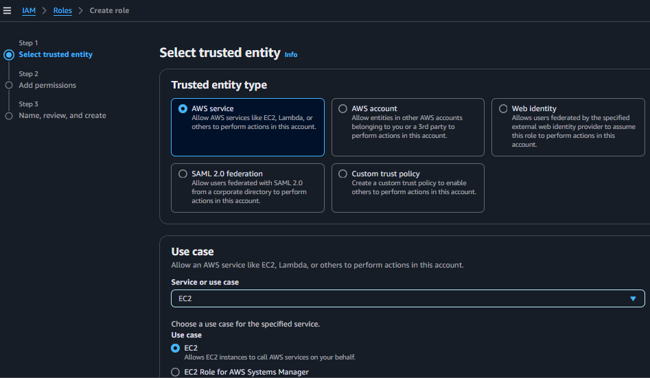


- Adiciona a Permissão `AmazonEC2RoleforAWSCodeDeploy`, clica em Next

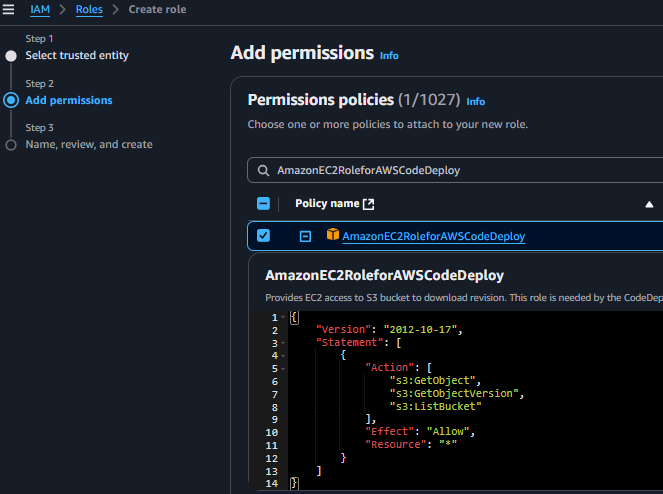

- Atribua o nome da role `FlaskAppEC2DeployRole` 
- Clica em `Create role` 

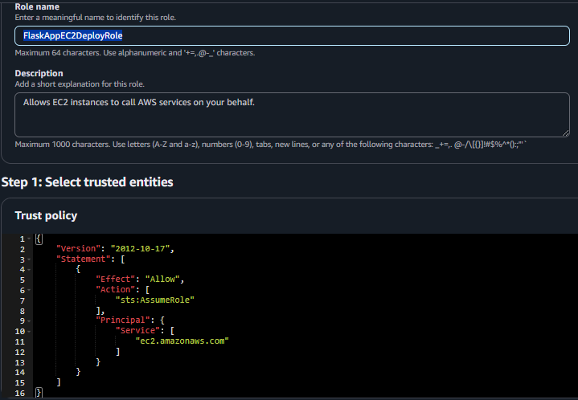

- É necessario incluir as seguintes permissões para realizar o envio dos Logs da EC2 para o CloudWatch:

``` yaml
{
  "Version": "2012-10-17",
  "Statement": [
    {
      "Effect": "Allow",
      "Action": [
        "logs:PutLogEvents",
        "logs:DescribeLogStreams",
        "logs:DescribeLogGroups",
        "logs:CreateLogStream",
        "logs:CreateLogGroup"
      ],
      "Resource": "*"
    }
  ]
}
```

### Configurando uma instância EC2 Instance para o AWS CodeDeploy


#### Name and tags
- Acessar EC2, `Launch Instance`
- Na seção `Name and tags`, clicar em `Add addional tags`
- Atribuir `Key`: `Application`
- Atribuir `Value`: `My Flask App Web Server`

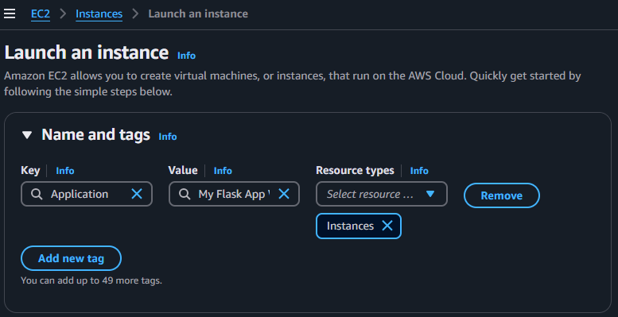

- Seleciona Amazon Machine Image (AMI): `Amazon Linux 2 AMI (HVM) (Free Tier)`
- Key pair (login): `Proceed without key pair`

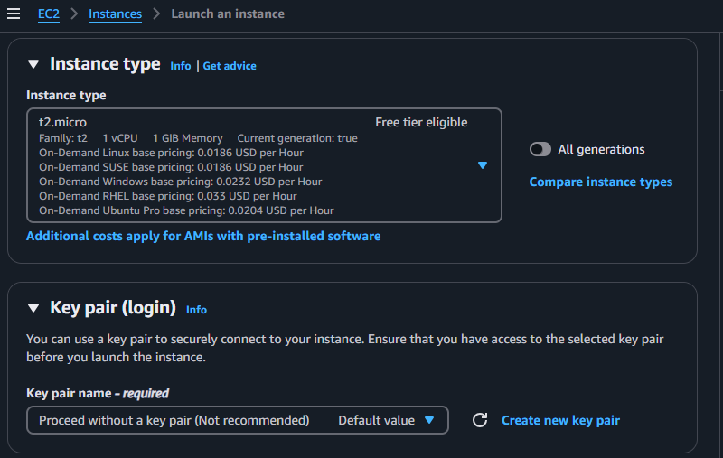


#### Network settings
- VPC padrão: EC2 deve ser iniciada em uma sub-red pública
- Subnet: No preference
- Auto-assign pubic IP: Enable
- Seleciona Create security group
- Security group name - required: web-server-security-group
- Clica em Add security group rule
-- Type: HTTP
-- Source type: Anywhere

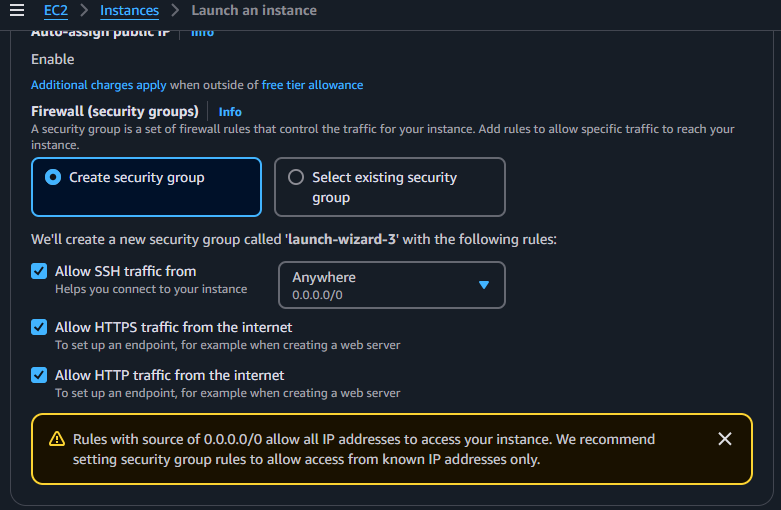

#### Advanced details 
- Na opção `IAM instance profile` seleciona a role que criamos anteriomente, `FlaskAppEC2DeployRole`
- Clica em `Launch Instance`

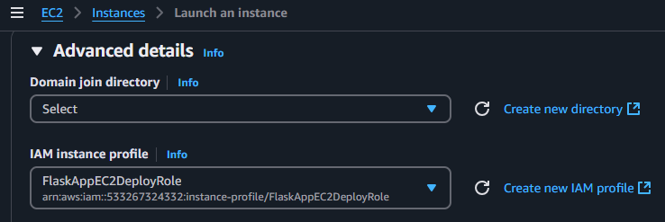

#### Iniciando a EC2

- Após iniciar a instancia, clica no `Instance ID`

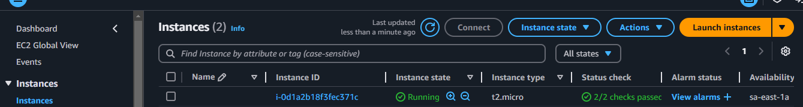

- É possível acessar a página na web utilizando o ipv4 DNS da instância e incluindo http:// no início.
- Clique em `Connect`

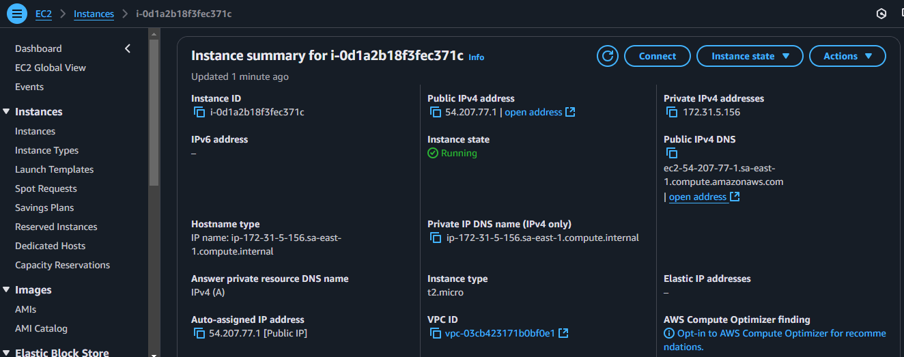

- Clique em `Connect`

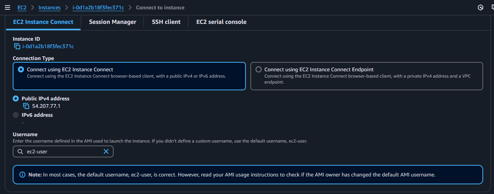

- Conectado à instância

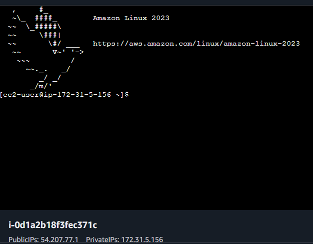


#### Instalando o CodeDeploy Agent

```	shell
# Instalando CodeDeploy Agent
$ sudo yum update -y
$ sudo yum install -y ruby wget

# Downloading CodeDeploy Agent
$ wget https://aws-codedeploy-sa-east-1.s3.sa-east-1.amazonaws.com/latest/install

$ ls -la 
$ chmod +x ./install
$ sudo ./install auto

# Verificando o status do CodeDeploy Agent
$ sudo service codedeploy-agent status
```

- Página de referência de download do agende codedeploy:
https://docs.aws.amazon.com/pt_br/codedeploy/latest/userguide/resource-kit.html#resource-kit-bucket-names

``` shell
# Downloading CodeDeploy Agent de outra região eu-west
$ wget https://aws-codedeploy-eu-west-1.s3.eu-west-1.amazonaws.com/latest/install 
```	

- Monstando o resulado do comando do status do CodeDeploy Agent

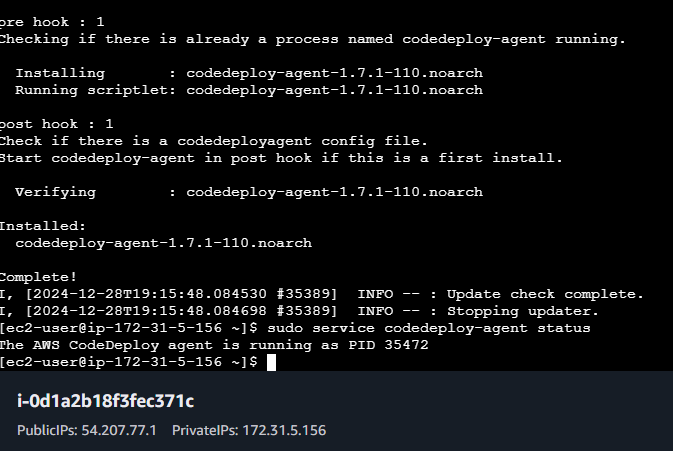

#### Instalando o Servidor Nginx


```	shell
# Instalando Nginx
$ sudo yum install -y nginx

# Checando Nginx status
$ sudo service nginx status

# Iniciando Nginx
$ sudo service nginx start

# Habilitando Nginx reiniciar
$ sudo systemctl enable nginx
```

- Servidor Nginx executando

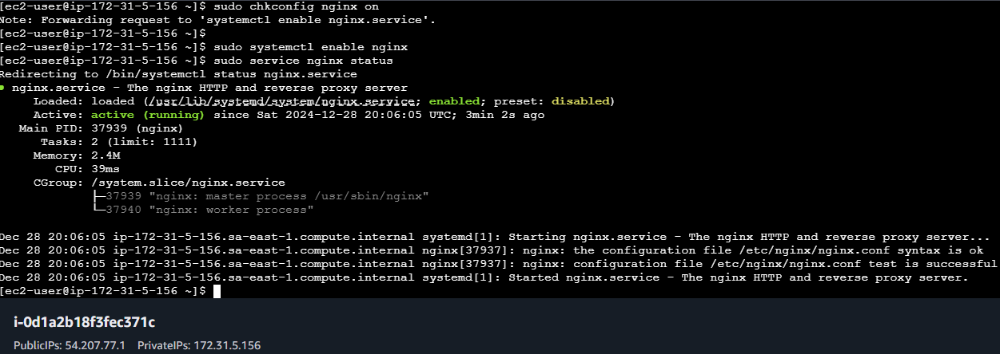


#### Criando o diretório para as implantações

``` shell
$ sudo mkdir -p /var/www/my-flask-app
```

- Alterando a caminho do diretório inicial do servidor

``` shell
$ sudo nano /etc/nginx/nginx.conf
```

- Alterar o `root` para `/var/www/my-flask-app`


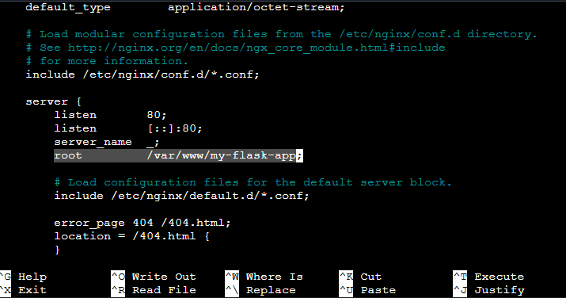

- Tecle `Ctrl + X` para sair, tecle no `Y` para salvar e clique no `Enter` para aprovar.

- No terminal da instância, executa os comandos definidos no arquivo ec2-instance-commands.txt
- Execute o seguinte comando para reiniciar os servidor

``` shell
$ sudo service nginx restart
```

- Acessando o servidor no navegador

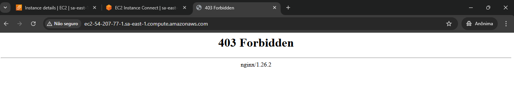


### Criando a Service role de Deployment

- Acesse IAM, seção `Roles`, selecione para criar
- Selecione a opção de caso de uso `CodeDeploy`
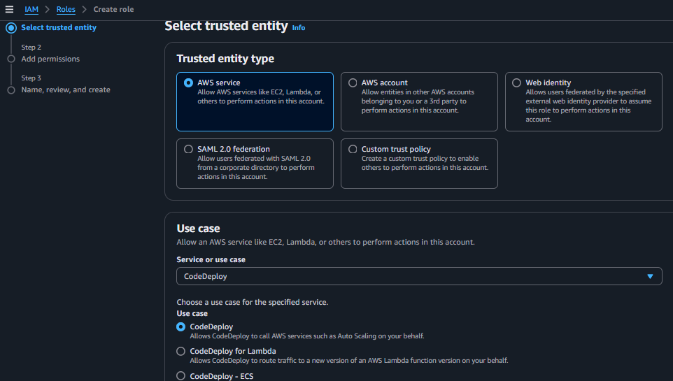

- Atribua o nome `MyFirstServiceRoleFlaskApp`
- Finalize a criação da role

### Criando Aplicação

- Atribua nome `MyFirstFlaskApp`
- Selecione `EC2/On-premises`
- Clique em `Create Application`

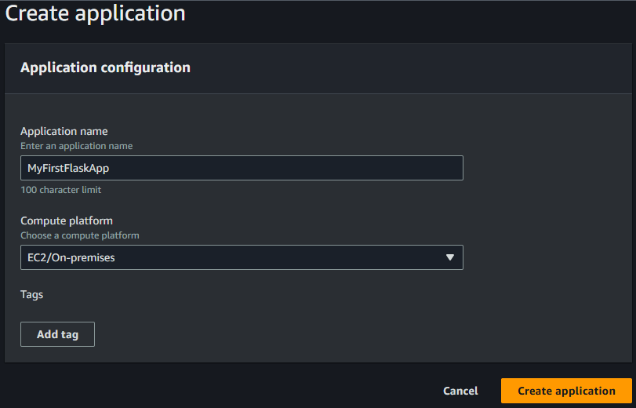

#### Criando Grupo de Deploy

- Cliquei `Create Deployment Group`
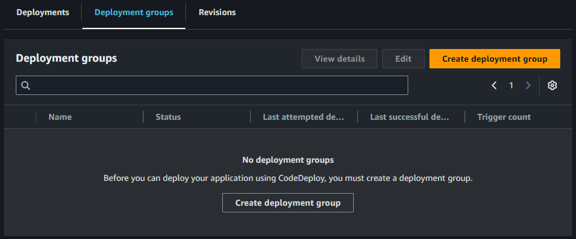

- Atribua o nome `MyFirstFlaskAppDeployGroup`

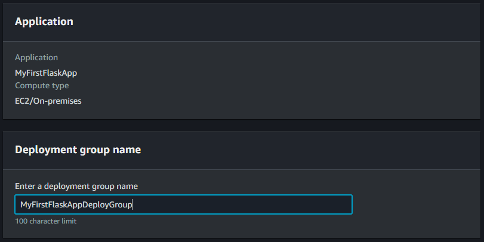

- Atribuindo o Service Role `MyFirstServiceRoleFlaskApp`

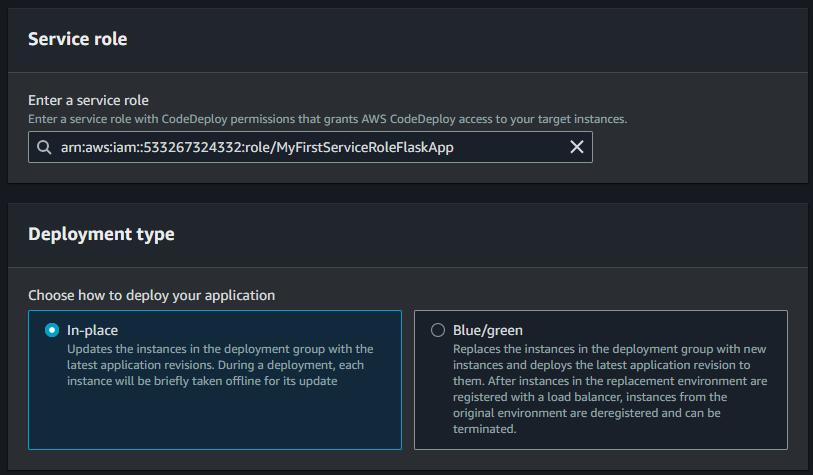

- Na seção `Environment configuration`, selecione `Amazon EC2 instances`

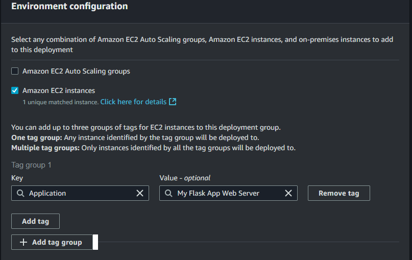

- Atribuir os valores `Application` e `My Flask App Web Server`, esses dois valores são tags que foram criadas durante a criação da instância EC2, podem ser conferiadas na seção `Tags` da própria instância

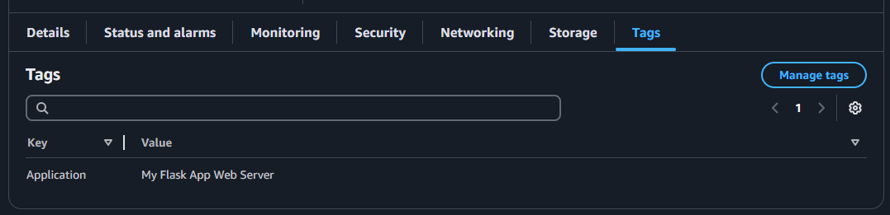

- Desabilite o `Load balance`
- Cliquei em `Create deployment group`


### Criando o CodePipeline

- Acesse a página do CodePipeline, seção Pipelines e cliquei em `Create Pipeline`.

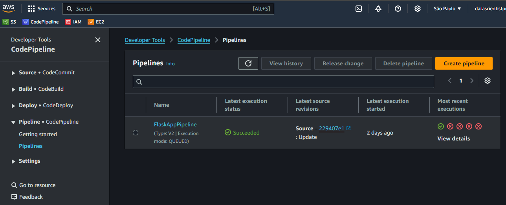

#### Selecionando o tipo de esteira

- Seleciona `Build custom pipeline`
- Cliquei em Next

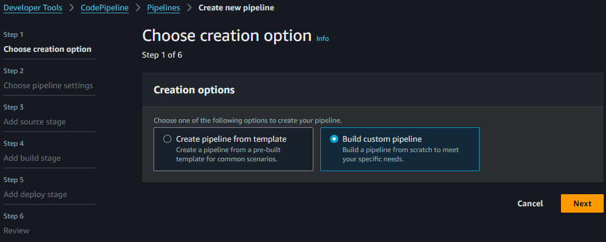

- Atribua o nome `MyFirstFlaskAppPipeline`

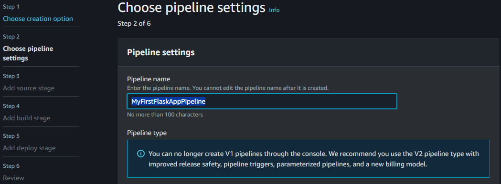

- Selecinoe `Queued (Pipeline type V2 required)`
- Selecione `New Service Role`

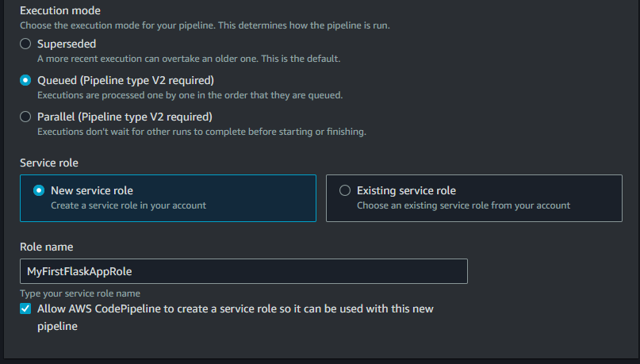

#### Configurando Advanced Settings
- Selecione as seguintes opções na seção `Advanced Settings`

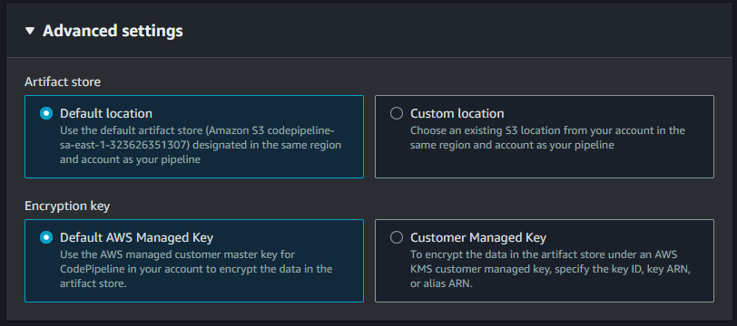

- Clique em Next

#### Definindo o Estágio de Origem

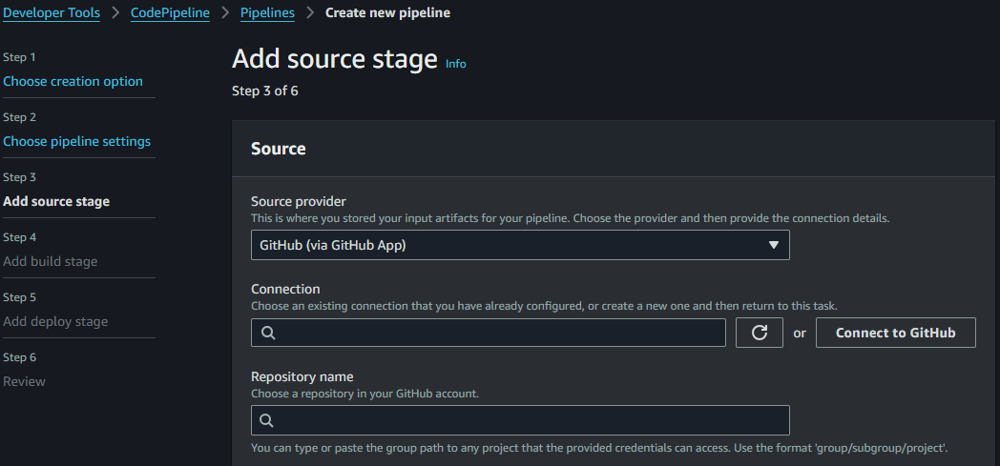

- Selecione GitHub App como o provedor de origem.
- Clique em `Connect to Github`
- Uma nova janele irá abri
- Atribua um nome para a conexão
- Siga as etapas seguinte para finalizar o login e conexão entre a aws e github

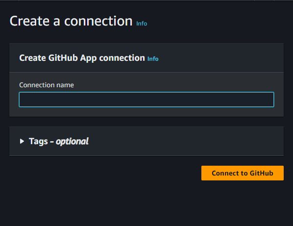

- Em seguinda, a `Connection` será preenchida
- Selecione o repositório e a branch que deseja conectar à pipeline

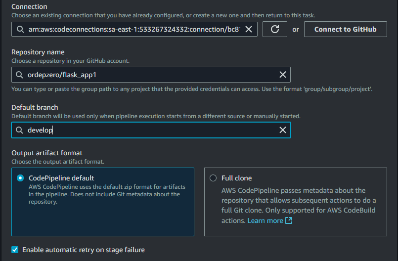

- Deixe habilitado o webhook
- Clique em Next

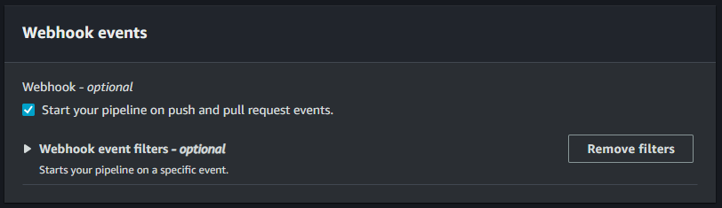

- Selecione `Skip build stage`

#### Definindo o Estágio Deploy
- Selecione a aplicação que foi criada `MyFirstFlaskApp`
- Selecione o `Deployment Group`
- Clique em Next e finalize a criação da pipeline

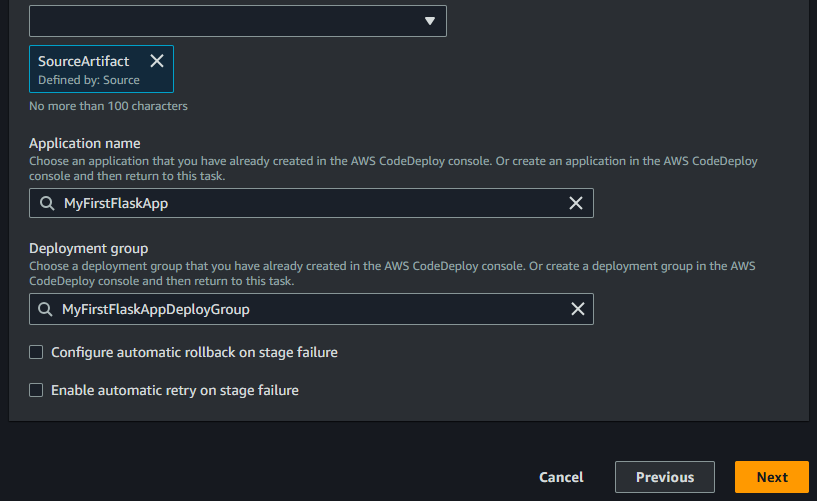


### Executando o deploy

- Logo que finaliza a criação a esteira começou a executar porém deu erro:

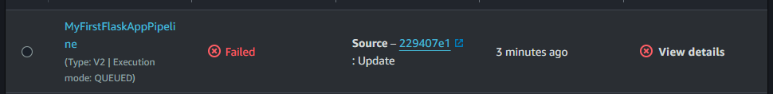

- Vamos realizar algumas instalações na instância:
    - python
    - ambiente virutal
    - flask
    - gunicorn

#### Instalando o Python
``` shell
$ sudo yum install python3 -y
$ python3 --version
```	

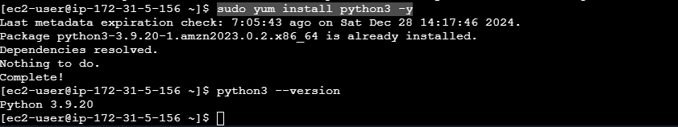

#### Instalando o Ambiente virtual e ativando

#### Instalando o Ambiente virtual e ativando

``` shell
$ sudo yum install python3 -y
$ sudo yum install python3-pip -y
$ pip3 install virtualenv
$ python3 -m venv myenv
$ source myenv/bin/activate
$ pip install flask
$ pip install gunicorn
```	

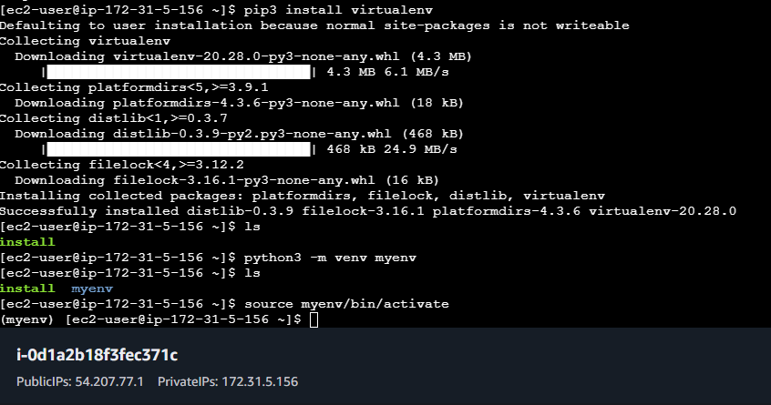

### Instalando o Log no EC2

- Precisa atribuir a política `CloudWatchAgentServerPolicy`à role da instância

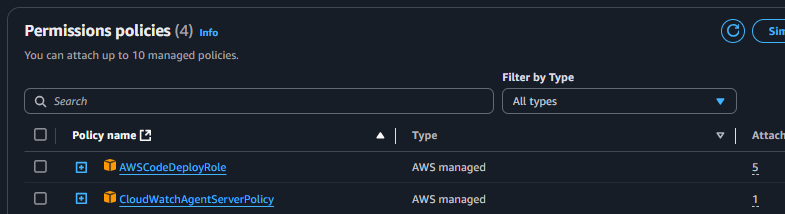

#### Configurando o arquivo de log

```	shell
$ wget https://s3.amazonaws.com/amazoncloudwatch-agent/amazon_linux/amd64/latest/amazon-cloudwatch-agent.rpm
$ sudo rpm -U ./amazon-cloudwatch-agent.rpm
$ sudo /opt/aws/amazon-cloudwatch-agent/bin/amazon-cloudwatch-agent-config-wizard
```

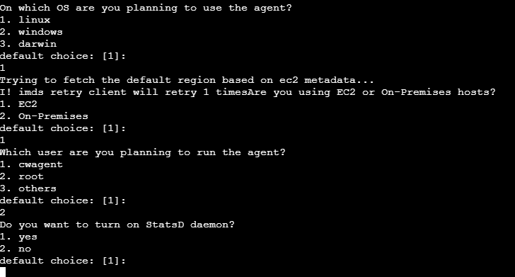

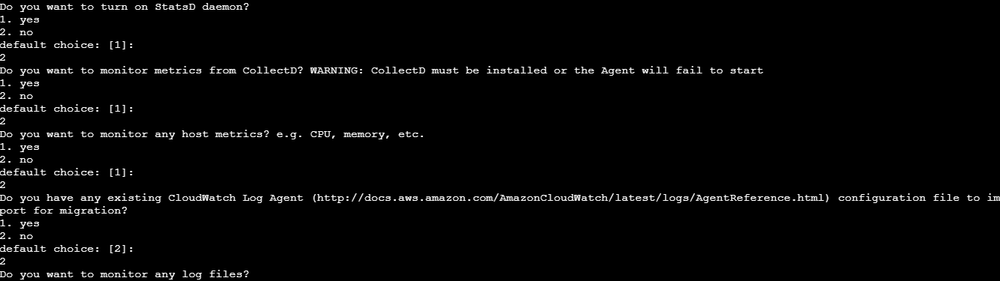

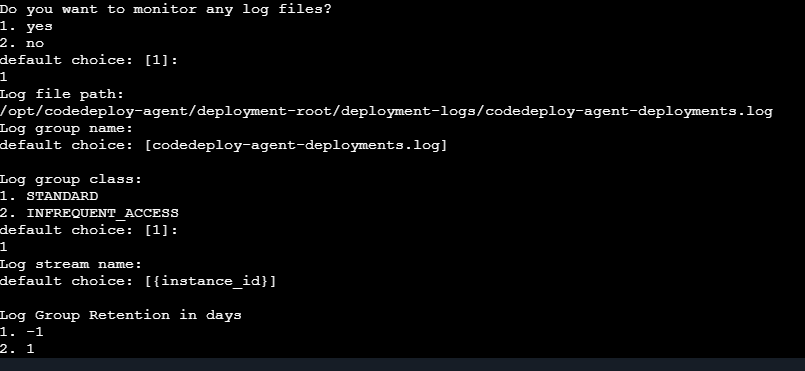

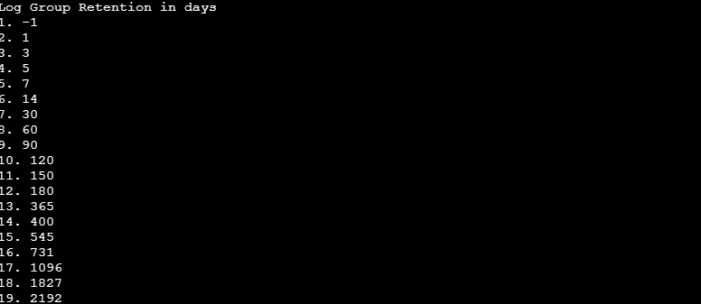

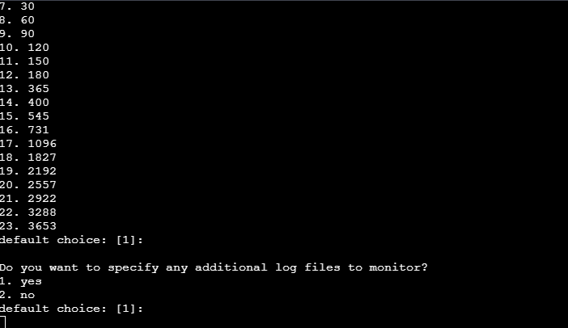

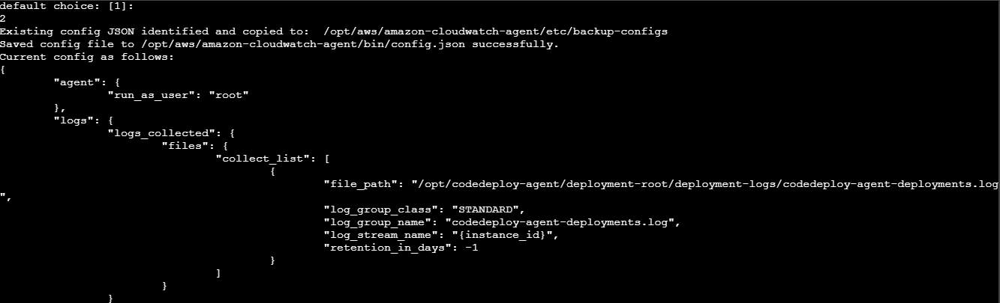

- Quando finalizar a criação do arquivo, execute o comando e inclua o trecho: `"timestamp_format": "[%Y-%m-%d %H:%M:%S.%f]"`

``` shell
$ sudo nano /opt/aws/amazon-cloudwatch-agent/bin/config.json
```

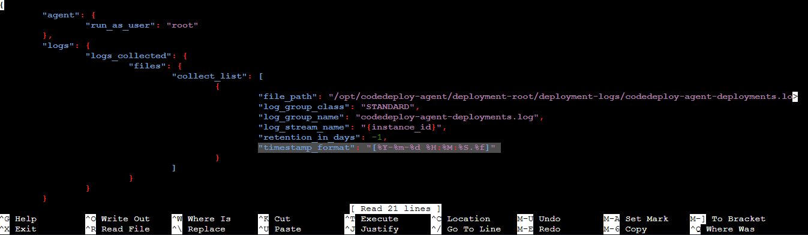

- Demais comandos para iniciar/parar a execução do agente

``` shell
# Start CloudWatch agent 
sudo /opt/aws/amazon-cloudwatch-agent/bin/amazon-cloudwatch-agent-ctl -a fetch-config -m ec2 -c file:/opt/aws/amazon-cloudwatch-agent/bin/config.json -s

# Stop CloudWatch agent
sudo /opt/aws/amazon-cloudwatch-agent/bin/amazon-cloudwatch-agent-ctl -m ec2 -a stop

# Check CloudWatch agent status
sudo /opt/aws/amazon-cloudwatch-agent/bin/amazon-cloudwatch-agent-ctl -m ec2 -a status
```	


# Direcionar a página inicial

Abrir o arquivo de config e incluir o trecho no seção `server`:

``` shell
$ sudo nano /etc/nginx/nginx.conf
```

``` config
server { 
    listen 80; 
    server_name _; 

    location / { 
        proxy_pass http://127.0.0.1:5000; 
        proxy_set_header Host $host; 
        proxy_set_header X-Real-IP $remote_addr; 
        proxy_set_header X-Forwarded-For $proxy_add_x_forwarded_for; 
        proxy_set_header X-Forwarded-Proto $scheme; 
    }
}
```

``` shell
# Testar a configuração
$ sudo nginx -t
# Reinicializar o servidor
$ sudo systemctl restart nginx
```

- Acesse o link da EC2 para veficiar a página que está sendo exibida:

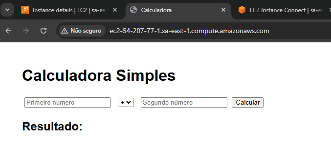